The file covers the quantity of various parts required to build a PX-Rack enclosure.

For step-by-step build instructions, see [Assembly-Steps.md](Assembly-Steps.md).

### 2-Node PX-Rack Enclosure: ### 

A 2-node PX-Rack enclosure has 18 parts that need 3D printing. The quantity of each part required is as under:

1. [Foot.stl](../STL/ABS/Foot.stl) - 4
2. [HDD-Mount.stl](../STL/ABS/HDD-Mount.stl) - 2
3. [HDD-Mount-Back-Plate.stl](../STL/ABS/HDD-Mount-Back-Plate.stl) - 2
4. [MB-IO-Panel.stl](../STL/ABS/MB-IO-Panel.stl) - 2
5. [MB-Mount-Back-Plate.stl](../STL/ABS/MB-Mount-Back-Plate.stl) - 2
6. [MB-Mounting-Plate.stl](../STL/ABS/MB-Mounting-Plate.stl) - 2
7. [Power-Mount-Back-Plate.stl](../STL/ABS/Power-Mount-Back-Plate.stl) - 1
8. [Power-Mount-Base.stl](../STL/ABS/Power-Mount-Base.stl) - 1
9. [Power-Mount-Grill.stl](../STL/ABS/Power-Mount-Grill.stl) - 1
10. [Power-Mount-PCB-Holder-Plate.stl](../STL/ABS/Power-Mount-PCB-Holder-Plate.stl) - 1
11. [25x265 Banding.stl](../STL/PLA_PETG/25x265%20Banding.stl) - 2
12. [Back-Cover.stl](../STL/PLA_PETG/Back-Cover.stl) - 2
13. [Bottom-cover.stl](../STL/PLA_PETG/Bottom-cover.stl) - 1
14. [Handel.stl](../STL/PLA_PETG/Handel.stl) - 2
15. [Left-Side-Panel-120mm-Fan-Power-Cut.stl](../STL/PLA_PETG/Left-Side-Panel-120mm-Fan-Power-Cut.stl) - 1
16. [Right-Side-Panel-120mm-Fan-Cut.stl](../STL/PLA_PETG/Right-Side-Panel-120mm-Fan-Cut.stl) - 3
17. [Top-Cover.stl](../STL/PLA_PETG/Top-Cover.stl) - 1
18. [Fan-Cut-120.stl](../STL/PLA_PETG/Fan-Cut-120.stl) - 4

To assemble a 2-Node PX-Rack enclosure, you will need the following parts:

1. <a href="../img/20mmx20mmAluminumExtrusions.png">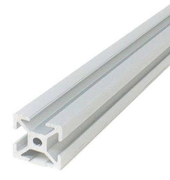</a> 20mm x 20mm Aluminum extrusions of the sizes listed as under 
   1. 350 mm - 6
   2. 200 mm - 4
   3. 300 mm - 4
2. <a href="../img/InCornerSlotConnector.png">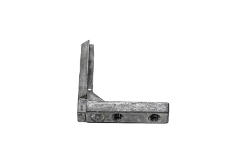</a> In Corner Slot Connector - 8
3. <a href="../img/CornerBracket.png">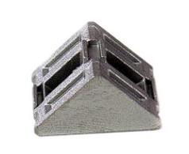</a> Corner Bracket - 16
4. <a href="../img/M4MSSlidingTNutFor2020SeriesAluminumExtrusions.png">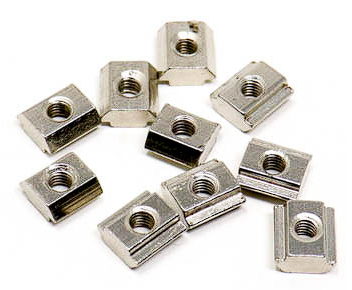</a> M4 MS Sliding T Nut For 2020 Series Aluminum extrusions - 150 
5. <a href="../img/M4_M3_Nuts_Bolts.jpg">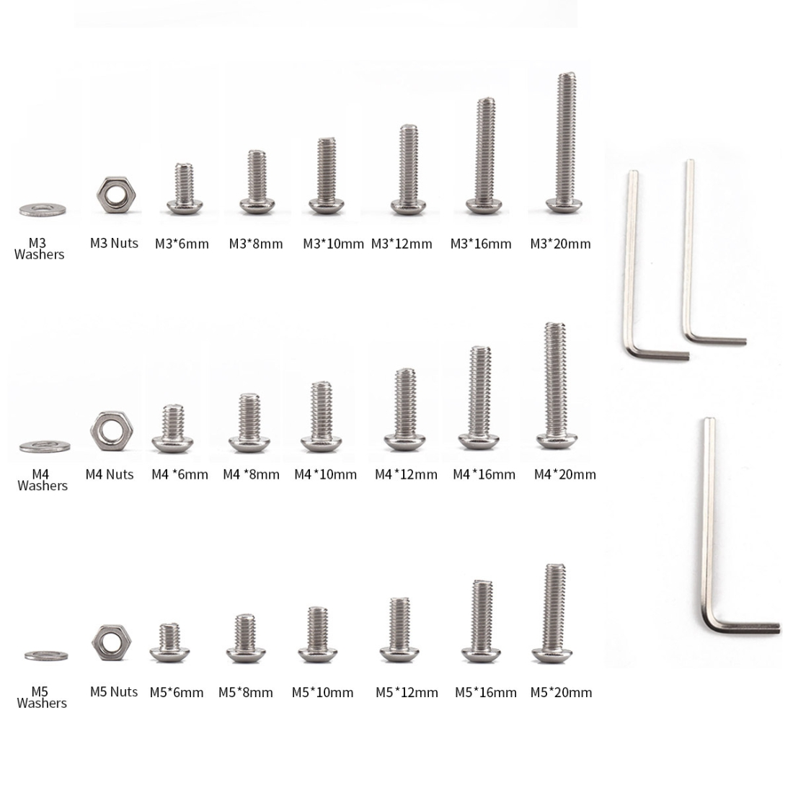</a> M4, M3 Nuts and Bolts 10 mm - 20
6.  M4, M3 Nuts and Bolts 12 mm - 20
7.  M4, M3 Nuts and Bolts 16 mm - 20
8. <a href="../img/M3StandOffsftf.jpg">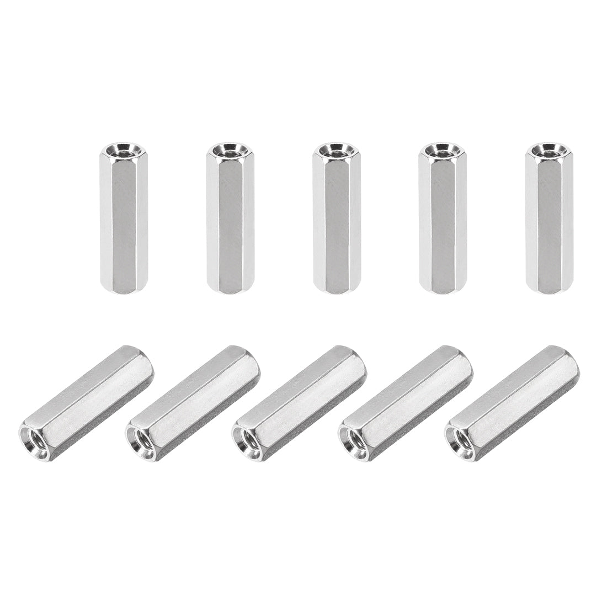</a> M3 Standoffs/Spacers Female to Female 10 mm - 30 
9.  M3 Headless Nuts 12 mm - 30
10. <a href="../img/ATX_power.jpg">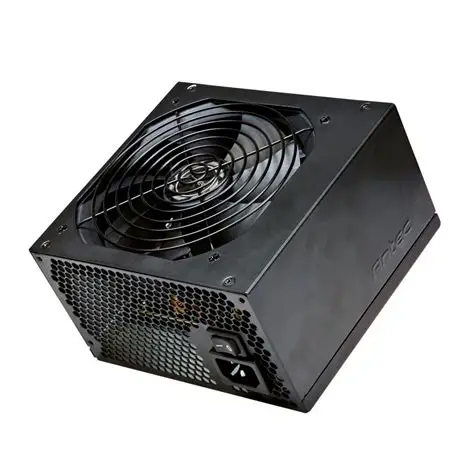</a> ATX power supplies 400w - 2
11. <a href="../img/PushButtons.png">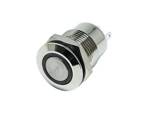</a> Push buttons - 4
12. <a href="../img/PushButtonWireSet.png">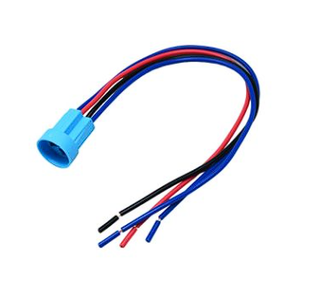</a> Push button Wire Set - 4 
13.  LT-633(SPL-63) Stationary, Type Quick Connection, Terminal - 1
14.  LT-933(SPL-93) Stationary Type Quick Connection Terminal - 1 
15. <a href="../img/IEC_C14_10AMPPowerConnector.png">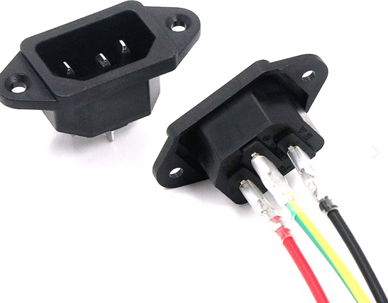</a> IEC, C14 10 AMP Power connector - 1
16. <a href="../img/PushFitLugs.jpg">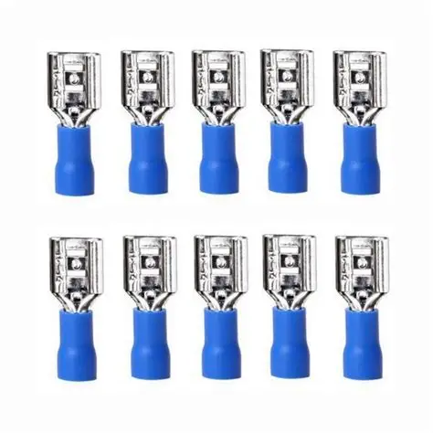</a> Push Fit lugs compatible with your IEC, C14 10 AMP Power connector - 5 
17. <a href="../img/120mmFan.jpg">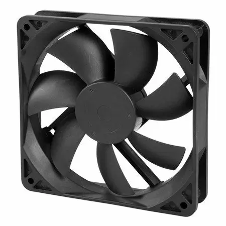</a> 120mm Cooling Fans - 2 (additional to the 2 fans included with the 2 ATX PSUs)
18. <a href="../img/3CoreWire.jpg">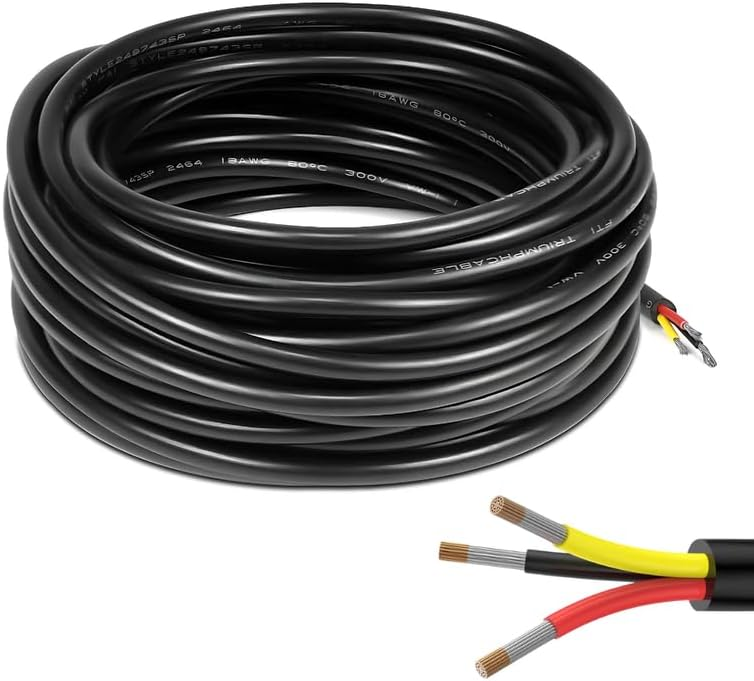</a> 3-Core 1.5 mm² PVC Insulated Flexible Copper Cable (IS 694) - 5 metre

### 4-Node PX-Rack Enclosure: ### 

A 4-node PX-Rack enclosure has 23 parts that need 3D printing. The quantity of each part required is as under:

1. [Foot.stl](../STL/ABS/Foot.stl) - 4
2. [HDD-Mount.stl](../STL/ABS/HDD-Mount.stl) - 4
3. [HDD-Mount-Back-Plate.stl](../STL/ABS/HDD-Mount-Back-Plate.stl) - 4
4. [MB-IO-Panel.stl](../STL/ABS/MB-IO-Panel.stl) - 4
5. [MB-Mount-Back-Plate.stl](../STL/ABS/MB-Mount-Back-Plate.stl) - 4
6. [MB-Mounting-Plate.stl](../STL/ABS/MB-Mounting-Plate.stl) - 4
7. [Power-Mount-Back-Plate.stl](../STL/ABS/Power-Mount-Back-Plate.stl) - 2
8. [Power-Mount-Base.stl](../STL/ABS/Power-Mount-Base.stl) - 2
9. [Power-Mount-Grill.stl](../STL/ABS/Power-Mount-Grill.stl) - 2
10. [Power-Mount-PCB-Holder-Plate.stl](../STL/ABS/Power-Mount-PCB-Holder-Plate.stl) - 2
11. [3mm-SwithBush.stl](../STL/PLA_PETG/3mm-SwithBush.stl) - 2
12. [5mm-Swith-bush.stl](../STL/PLA_PETG/5mm-Swith-bush.stl) - 2
13. [25x265 Banding.stl](../STL/PLA_PETG/25x265%20Banding.stl) - 2
14. [240mm-Banding.stl](../STL/PLA_PETG/240mm-Banding.stl) - 1
15. [Back-Cover.stl](../STL/PLA_PETG/Back-Cover.stl) - 4
16. [Bottom-cover.stl](../STL/PLA_PETG/Bottom-cover.stl) - 1
17. [Handel.stl](../STL/PLA_PETG/Handel.stl) - 2
18. [Left-Side-Panel-120mm-Fan-Power-Cut.stl](../STL/PLA_PETG/Left-Side-Panel-120mm-Fan-Power-Cut.stl) - 1
19. [Left-Side-Panel-120mm-Fan-Switch-Cut.stl](../STL/PLA_PETG/Left-Side-Panel-120mm-Fan-Switch-Cut.stl) - 3
20. [Right-Side-Panel-120mm-Fan-Cut.stl](../STL/PLA_PETG/Right-Side-Panel-120mm-Fan-Cut.stl) - 4
21. [Switch-Banding.stl](../STL/PLA_PETG/Switch-Banding.stl) - 1
22. [Top-Cover.stl](../STL/PLA_PETG/Top-Cover.stl) - 1
23. [Fan-Cut-120.stl](../STL/PLA_PETG/Fan-Cut-120.stl) - 8

To assemble a 4-Node PX-Rack enclosure, you will need the following parts:

1.  20mm x 20mm Aluminum extrusions of the sizes listed as under 
   1. 700 mm - 6
   2. 200 mm - 4
   3. 300 mm - 4
   4. 45 mm - 1
2.  In Corner Slot Connector - 10
3.  Corner Bracket - 16
4.  M4 MS Sliding T Nut For 2020 Series Aluminum extrusions - 300 
5.  M4, M3 Nuts and Bolts 10 mm - 40
6.  M4, M3 Nuts and Bolts 12 mm - 40
7.  M4, M3 Nuts and Bolts 16 mm - 40
8.  M3 Standoffs/Spacers Female to Female 10 mm - 60 
9.  M3 Headless Nuts 12 mm - 60
10.  ATX power supplies 400w - 4
11.  Push buttons - 8
12.  Push button Wire Set - 8
13.  LT-633(SPL-63) Stationary, Type Quick Connection, Terminal - 2
14.  LT-933(SPL-93) Stationary Type Quick Connection Terminal - 1 
15.  IEC, C14 10 AMP Power connector - 1
16.  Push Fit lugs compatible with your IEC, C14 10 AMP Power connector - 5 
17.  120mm Cooling Fans - 4 (additional to the 4 fans included with the 4 ATX PSUs)
18.  3-Core 1.5 mm² PVC Insulated Flexible Copper Cable (IS 694) - 5 metre