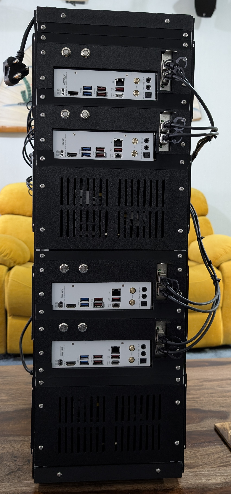
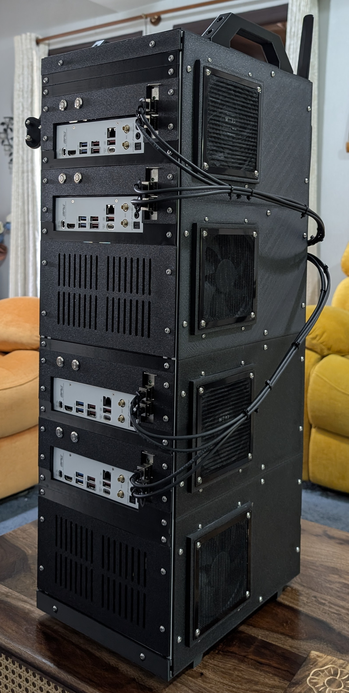
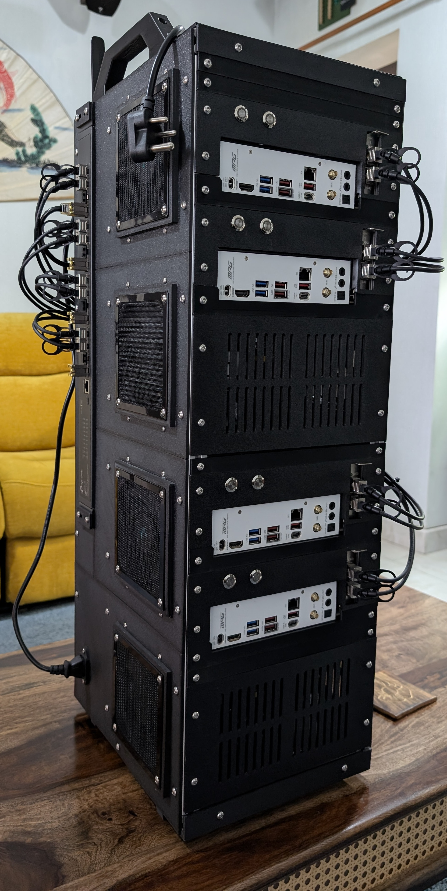
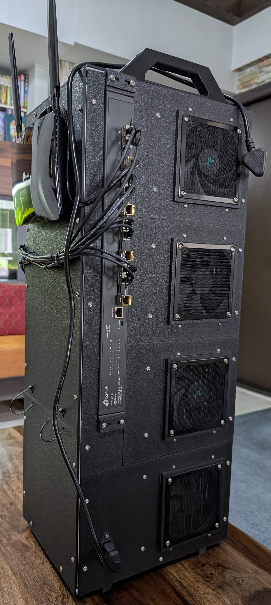
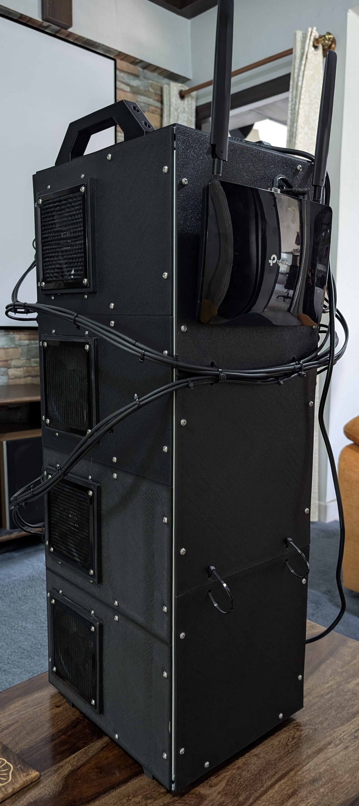
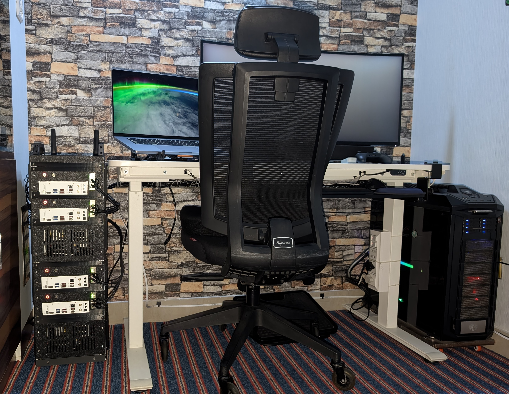

## What is a PX-Rack

Personal Experience Rack, or PX-Rack, is a modular DIY computer rack-style enclosure built for creators who value scalability, customization, and hands-on engineering. Designed to integrate multiple [Mini-ITX](https://en.wikipedia.org/wiki/Mini-ITX) motherboards into a single compact unit, PX-Rack is ideal for homelabs, clustered compute nodes, or multi-OS test environments.

The first use case is [Broadcom VMware Cloud Foundation](https://www.vmware.com/products/cloud-infrastructure/vmware-cloud-foundation). 

## 🛠️ Skills Required to Build a PX-Rack

Building a PX-Rack is not a beginner project. You will need:

1. **Miter saw** — for cutting extrusions and structural components to precise lengths
2. **Soldering** — primarily a safety net for human error during wiring
3. **Specialty tools** — screwdrivers and Allen keys in M2, M3, and M4 sizes, plus Torx drivers T2, T3, and T4
4. **ATX power supply disassembly** — you will need to open and modify a standard ATX PSU

> If any of these sound daunting, that is perfectly reasonable. Reach out using the details in the [Contact details](#-contact-details) section to order a pre-built PX-Rack — or engage directly with the designer if you are mad enough to attempt this yourself.

### 2-Node PX-Rack Enclosure: ### 
#### Render:


#### Actual: 

Not built, hence no images are available. However, it will be identical to the bottom half of a 4-node enclosure.

### 4-Node PX-Rack Enclosure: ### 
#### Render:


#### Actual:






### PX-Rack vs Full Tower
On the left is PX-Rack, and on the right is the Cooler Master Full Tower Case.



<video width="600" controls>
  <source src="img/4-Node/PXL_20260615_170057228%7E2.mp4" type="video/mp4">
</video>

## What sets PX-Rack apart? 

It is Portable, Purpose-Built, and Open-Source

**🔌 Streamlined Power Management**
Unlike traditional racks designed for data centers or server rooms, PX-Rack is purpose-built for commercial hardware. Instead of juggling multiple external power cables, PX-Rack aggregates multiple power supplies into a single external cable using PCT wire connectors.
- No need for extension cords
- No soldering required
- Clean, efficient cable management

**PCT wire connectors:**


**📏 Optimized Dimensions**
Width and length — not height — are the critical factors in PX-Rack’s design. 10 Gb optical fiber cables are neatly routed from the side and back to a switch integrated into the rack. The cables move with the rack, so there is no need to recable when shifting locations. With switch I/O remaining easily accessible, network retopology is straightforward — a true lab must-have.

**🛠 Maker-Friendly Construction**
Most of PX-Rack’s structural components are 3D-printable, making it accessible and affordable for solo builders and makers.
- STL files available via GitHub
- No proprietary parts
- Community-driven, open-source flexibility

**🌬 Airflow & Multi-Node Freedom**
Whether you’re optimizing airflow, managing cables, or experimenting with multi-node setups, PX-Rack gives you the freedom to build infrastructure your way. It’s a platform designed for experimentation, customization, and scalability.

## Why PX-Rack?

_A Mini-ITX cluster enclosure with integrated power management — purpose-built for homelabbers_

### The Problem

Homelabbers and VMware/VCF engineers in India building multi-node compute environments face a painful choice: import an expensive, generic rack cabinet that wasn't designed for their use case, or cobble something together with zip ties and a shelf. Neither works for a professional-grade homelab or demo rig.

### PX-Rack vs DeskPi

| Feature | PX-Rack | DeskPi |
|---|---|---|
| Price (India, enclosure only) | 2-Node ~INR 15,000 / 4-Node ~INR 22,000 | T0-Plus ~INR 9,000–11,000 + customs / T2 Light ~INR 16,000–20,000 + customs |
| Integrated power management | Yes | No |
| Purpose-built for Mini-ITX clusters | Yes | No — generic cabinet |
| Direct crossover network ready (2-Node) | Yes | No |
| Integrated switch bay (4-Node) | Yes | No |
| Mini-ITX motherboards housed | 2 (2-Node) / 4 (4-Node) | User-supplied, bare cabinet |
| PCIe expansion | 1x half-height slot per node | Depends on user's own case/riser |
| 2.5" disk bays | 8 total (2-Node) / 16 total (4-Node) | User-supplied |
| ATX PSUs, pre-wired to single AC inlet | 2 (2-Node) / 4 (4-Node) | User sources & wires own PSU(s) |
| Cooling fans preinstalled (PSU + compute, push-pull) | 4x 120mm (2-Node) / 8x 120mm (4-Node) | User adds own fans |
| Custom 5–12V power delivery for peripherals (on request) | Yes | No |
| 3D-printable / customizable | Yes | No |

### Dimensions

| | Depth | Width | Height |
|---|---|---|---|
| 2-Node | 300mm | 248mm | 375mm |
| 4-Node | 300mm | 248mm | 750mm (also fits a full-width 1U switch/router) |

### PX-Rack vs Standard 1U/2U Rack Servers

- **Compute density**: PX-Rack 4-Node = 4 independent Mini-ITX nodes vs 1 dual-socket board in a typical 1U/2U server
- **Cooling**: PX-Rack runs 8x 120mm fans, push-pull, at fixed full speed at all times (no fan curve) vs small high-RPM fans in 1U / larger slower fans in 2U that usually ramp with load
- **Noise, system off**: baseline room noise vs ~25 dBA idle (1U, e.g. Dell PowerEdge R630) / ~30–40 dBA idle (2U)
- **Noise, system running**: PX-Rack ~78 dB (constant, since fans never throttle down) vs 1U servers commonly high-70s to 90+ dB under full load ("jet engine" fan spin-up is a known 1U trait), 2U servers ~38–65 dB.

Is 78 dB loud for server gear? 

Not particularly — it lands inside the range enterprise 1U servers reach under full thermal load. It's louder than a 2U server, but that's expected: PX-Rack is doing 1U-style airflow work across 4 independent nodes, not one, and its fans run at fixed full speed continuously rather than ramping with load. It is possible to tune the Mini-ITX motherboards to run quiet. However, this many cause CPU to thermal throttle.

_How it was measured:_ 

Google Pixel 8 Pro decibel-meter app, phone placed directly on top of the chassis, comparing system-off vs system-on. This is a near-field, single-device reading, not a calibrated sound meter at the standardized 1-meter bystander position vendor datasheets use — so it's a directional comparison, not a strict apples-to-apples one. If anything, the PX-Rack number likely reads a bit higher than an equivalent 1m measurement would.

### Core Value Arguments

1. **Integrated Power** — DeskPi gives you a bare cabinet with no power story; you run your own cables and figure out PDUs. PX-Rack aggregates all node power into one external connection: one plug in, cleaner cable runs, no external PDU needed.
2. **Purpose over generic** — DeskPi sells an empty cabinet designed for anything. PX-Rack's form factor, cable routing, and power topology are built specifically for Mini-ITX cluster nodes.
3. **India-first, no import friction** — no customs, no 20–30% import duty, no 3–6 week shipping wait, no warranty risk from courier damage. Ships from Bengaluru.
4. **Built for the homelab/VCF use case** — designed for Broadcom VMware Cloud Foundation multi-node lab deployments.
5. **Open, modifiable, repairable** — every structural part is 3D-printable in ABS, PETG, or PLA. Broke a bracket? Print a new one in 2 hours.
6. **Natural upgrade path** — start with 2-Node at ~INR 15,000, expand to 4-Node with switch bay at ~INR 22,000 as your lab grows.

### Who This Is For

- VMware/VCF engineers building a personal lab rig
- Homelabbers who want a clean, portable, rackable cluster — not a desk full of towers
- IT teams needing a compact demo environment they can carry to client sites
- 3D printing enthusiasts who want to contribute to or customize an open-source hardware project

### The Engineering Effort Behind It

Worth saying plainly, without dressing it up: PX-Rack was designed and built by one person, in under 12 months, from a first sketch to a working 4-node unit. No one else on the team contributed to design or build work — teammates gave feedback along the way that genuinely helped shape the final design, but the mechanical design, wiring, power aggregation, 3D printing, and integration were done solo.

That context matters for judging the failures and the time it took. PX-Rack doesn't reuse an existing enclosure playbook — it isn't a resized server chassis or a repurposed generic cabinet like DeskPi's. It combines Mini-ITX motherboards, multiple ATX power supplies aggregated onto a single AC inlet, HDD trays, and push-pull cooling for both compute and power units, all inside a footprint that also leaves room for a rack switch — without falling back on shortcuts from known, off-the-shelf integration methods.

Given that, the time spent getting to a working 4-Node PX-Rack isn't a sign of a rough process — they're what it costs to solve integration problems that had no existing off-the-shelf answer, without compromising on function to get there.

### Further Reading

- [DeskPi RackMate collection](https://deskpi.com/collections/deskpi-rack-mate)

## Repository structure 
```
PX-Rack/
├──Build_Instructions/
│   ├──README.md      
│
├── STL/
│   ├── ABS/
│   │   ├── PART_NAME01.stl
│   │   ├── PART_NAME02.stl
│   │
│   ├── PLA_PETG/
│   │   ├── PART_Name01.stl
│   │   ├── PART_Name01.stl
│   │
│   ├── Templates/
│   │   ├── TEMPLATE_NAME01.dxf
│   │   ├── TEMPLATE_NAME02.dxf
└── README.md
    └── Introduction to PX-Rack, and licensing.
```
# 📜 Terms and Conditions of Use

By accessing or using the PX-Rack repository, you agree to the following terms:

## 🔧 Personal and Lab Use Only
- This repository is intended solely for **individual, non-commercial use**.
- You may use the provided STL files and documentation to build PX-Rack units for:
  - Personal projects
  - Homelabs
  - Educational setups
  - Non-profit experimentation

## 🚫 Commercial Restrictions
- **Commercial use** of any files, designs, or derivatives is **strictly prohibited** without **explicit written permission** from the repository owner.
- This includes, but is not limited to:
  - Selling printed parts or assembled units
  - Using PX-Rack designs in paid services or commercial installations
  - Distributing modified versions for profit

## 📝 Requesting Permission
- To request commercial usage rights, please contact the repository owner via GitHub or the contact method listed in the main `README.md`.

## 📁 Licensing
- All files are provided "as is" without warranty. Users are responsible for safe printing, assembly, and deployment.
- Redistribution of files must retain original attribution and must not misrepresent the origin or intent of the project.

## 📬 Contact details
- **Name:** Akshay Kalia
- **Email:** akshay@vmzoneblog.com
- **Location:** Bengaluru, Karnataka, India
- **Website:** https://vmzoneblog.com

## FAQs ##

### Why is PDF or STL not loading on Git UI? ###

This behavior is observed when you are connecting to the public GitHub server from a corporate network. Try disabling the VPN and then access the repository.

### What is STL? ###
In 3D printing, STL files are the most common file format used to describe 3D models. STL stands for STereoLithography (or sometimes Standard Triangle Language) and encodes the surface geometry of an object using triangular facets that slicing software can interpret. A slicing software is the tool that converts a 3D model (like an STL file) into layer-by-layer instructions (G-code) that a printer can understand and execute. 

### What is ABS? ###
ABS stands for Acrylonitrile Butadiene Styrene. It is a thermoplastic polymer widely used in 3D printing, especially with FDM (Fused Deposition Modeling) printers. Known for being strong, durable, and impact-resistant, ABS is the same material used in LEGO bricks, car dashboards, and protective housings.

The glass transition temperature of ABS is between 100 and 120 °C. Hence, it is best suited for components operating close to heat-generating parts in the PX-Rack.

### What is PETG? ### 

PETG stands for Polyethylene Terephthalate Glycol-modified. It is a thermoplastic derived from PET (the same plastic used in water bottles), with glycol added to improve durability and reduce brittleness. PETG combines the ease of printing of PLA with the strength and heat resistance of ABS, making it a versatile middle-ground filament.

The glass transition temperature of PETG is between 80 and 100 °C. While it can be used for external parts, it is not suitable for components operating in the vicinity of heat-generating elements in the PX-Rack.

### What is PLA? ###
PLA stands for Polylactic Acid. It is a biodegradable thermoplastic made from renewable resources such as corn starch or sugarcane. PLA is the most widely used filament in desktop 3D printing because it is easy to print, affordable, and environmentally friendly compared to petroleum-based plastics like ABS.

However, the glass transition temperature of PLA lies between 60 and 80 °C. As a result, a large number of PX-Rack components cannot be manufactured using PLA.

PLA should only be used for printing PX-Rack parts as a last resort when printing in PETG is not possible.

